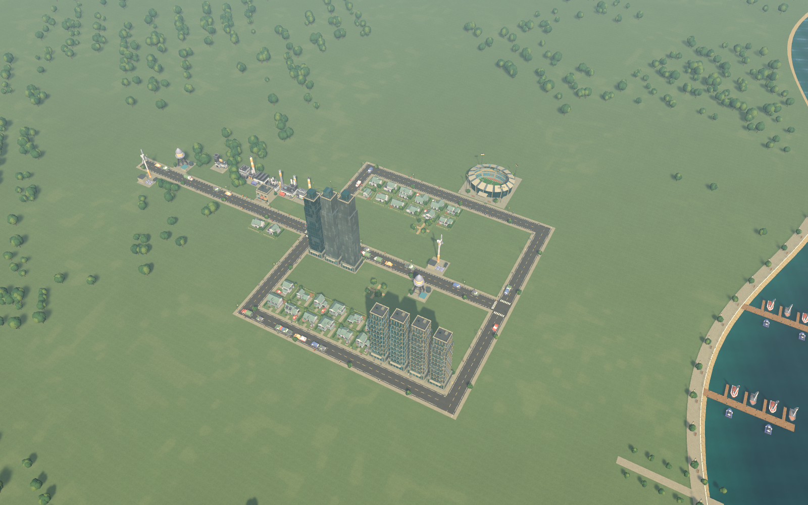

# Seabright review

**Version 0.2.1 · reviewed 9 September 2026**

Seabright now supports a coherent journey from a small coastal settlement to an operating district with towers and a stadium. The strongest result is the integrated growth loop: purchases, services, employment, occupancy and budget consequences work together. The presentation and sound make that state readable. Its remaining gaps are those of a compact stylized prototype: sparse world composition, repeated assets, simple street behavior and limited service depth.

## Start small

The normal starting state has 24 residents, $30,000, essential utilities and substantial empty land. Homes, a shop and an industrial building have different silhouettes. This replaces the original prebuilt city, which gave the player little sense of creating a settlement.

## Grow a connected district

This city comes from the retained autonomous growth save. The scenario bought construction through the live world-input handler and reached 609 residents with a working stadium, approximately $17,307 in the treasury and +$197/day net income. No money or population was injected. The first construction ran at 1×; later simulation waiting was accelerated. The pictured layout is a reproducible test city, not a claim of optimal urban planning.

## Unlock a modern skyline

Separate office and residential tower zones give growth a visible destination. Ordinary houses remain small, while towers add glazing, setbacks, balconies and planted terraces. Building variety and district composition still need work: repeated silhouettes and broad empty spaces are visible at this scale.

## Build a landmark

The stadium has seating, field markings, roof segments, floodlights and a glazed concourse. Its simulation reserves a 3 × 3 site, charges once, demands utilities and provides 64 jobs. The current scale is compressed relative to nearby houses. It does not yet simulate matches, ticket sales, crowds or event traffic.

## Change the atmosphere

Night changes building windows, streetlight pools, water and the overall lighting palette. Music continues, daytime birds fade down and nocturnal ambience fades up. The treatment is deliberately stylized; stronger material response, more restrained window patterns and richer environmental composition remain art goals.

## Manage the sound

The latest update adds an original score, coast/town/nature layers and action feedback. Four sliders control master, music, ambience and effects; M mutes the mix. A [12-second recording from the real game mixer](../Artifacts/audio-preview.wav) includes the soundtrack and construction activity. It was captured without normalization, with no clipped samples. Source-waveform and runtime-output checks were performed; this is not a claim of a subjective speaker-listening evaluation.

## What changed after player feedback

| Feedback | Result in the demo | Remaining gap |
|---|---|---|
| Homes, shops and industry looked identical | Distinct category-colored sites, house gardens/roofs, retail awnings and industrial yards | More authored variants and better street-facing alignment |
| No visible cars or people | Fixed stripped rendering variants; actual car/walker pixels and movement verified | Intersection behavior, separation, crossings and meaningful commutes |
| Flat or crude surfaces | Reused scanned material maps, smoother trees, surface detail, revised water and lighting | Still economical meshes, flat terrain and sparse landscaping |
| Black/blank toolbar icons | Cached antialiased texture masks with category colors and clear labels | More native UI interaction coverage across display scales |
| Little sense of building and growing | Small starter, lasting unlocks, grants, towers, offices and a serviced stadium | Wider civic progression, terrain/region expansion and deeper simulation |
| Missing sound | Five environment/music loops and ten effects, mix controls and persistence | Longer musical development and richer context-specific sound events |

## Evidence and capture method

The five city images on this page are **fresh 1600 × 1000 renders from the current source in Unity Editor Play mode**, using the live game camera, normal shaders/image effects and hidden interface. They load either the normal starter or the previously earned growth fixture. [Capture metadata](Images/capture-info.json) records source version and engine. Reproduce them with `bash Tools/capture-review.sh` after the growth fixture exists. The sound-panel image is the retained **0.2.1 standalone** capture. These images are engine renders, with no generative repainting or stock render substitution.

The current source was compiled for the review capture. The prior runtime journeys were not repeated simply to obtain images:

| Verification | Retained result |
|---|---|
| Simulation acceptance before the audio revision | **15/15** passed |
| Standalone growth/render/input, version 0.2.0 | **33/33** passed |
| Standalone audio/input, version 0.2.1 | **36/36** passed |
| Native 0.2.1 build | Zero build errors and warnings |
| Audio preview | Stereo 48 kHz, 12 s, peak 0.422362, zero clipped samples |
| Active grown-city performance sample | Mean 118.2 FPS, p95 9.03 ms, worst 66.35 ms; five-second sample on Apple M5 Pro/Metal |

The growth/rendering report predates the audio build. Simulation and rendering algorithms were unchanged by that update; documentation publication adds editor capture tooling only. [Implementation](IMPLEMENTATION.md) links the raw reports and explains their limits. Programmatic pointer calls exercise the live construction path; they are not operating-system mouse synthesis. Native keyboard checks worked, but computer-control mouse coordinates were offset on the test Retina display. The sound panel was opened through its public method for capture; native slider dragging remains unverified by automation.

The reference was assessed using official Cities: Skylines product information and its manual; a separate retail copy was not launched for a side-by-side playthrough. The demo demonstrates an AI-assisted development and revision process, while its commercial-game quality gap remains visible in these images and the documented mechanics. The prioritized plan for further work is in [Implementation and next steps](IMPLEMENTATION.md#prioritized-next-steps).
