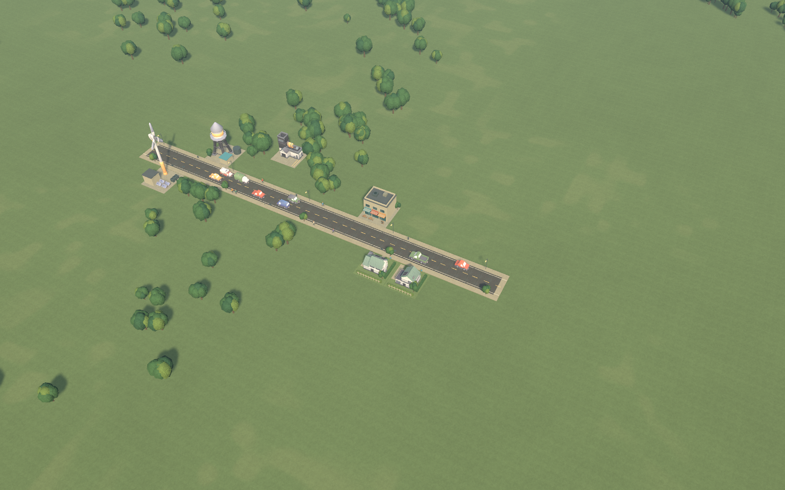
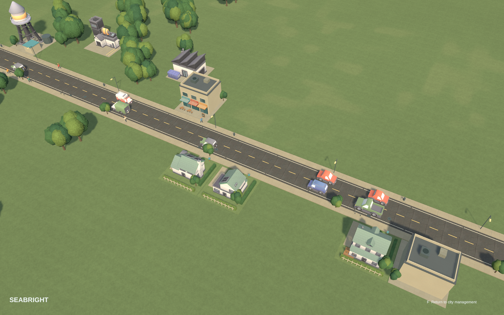
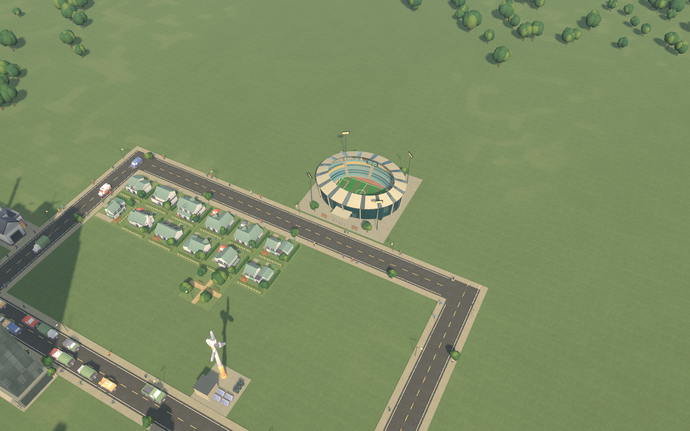
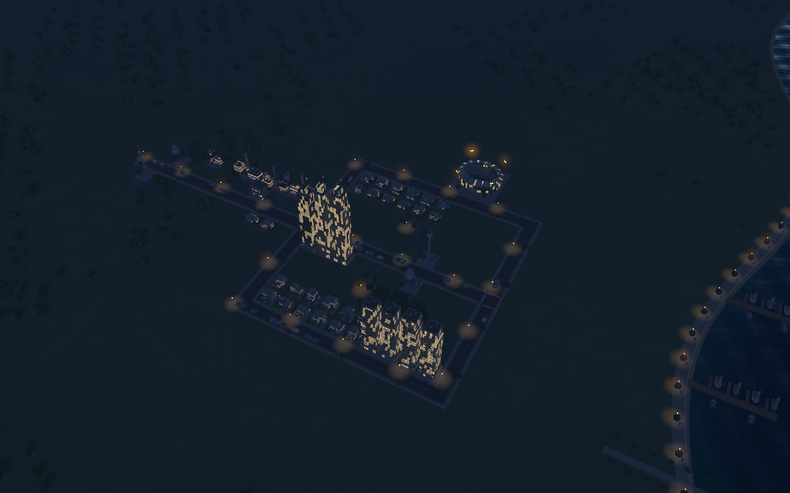
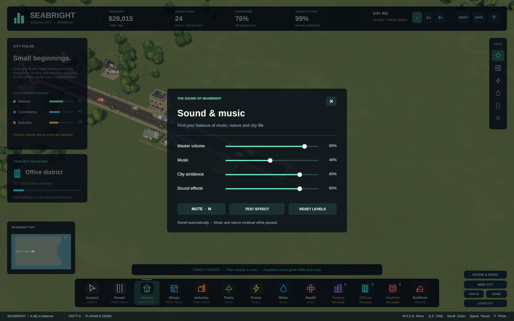
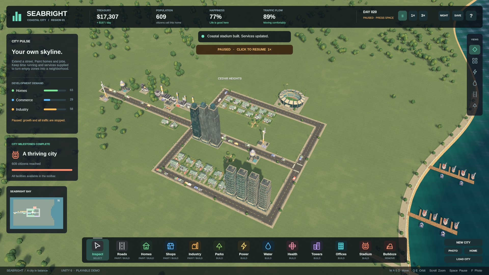
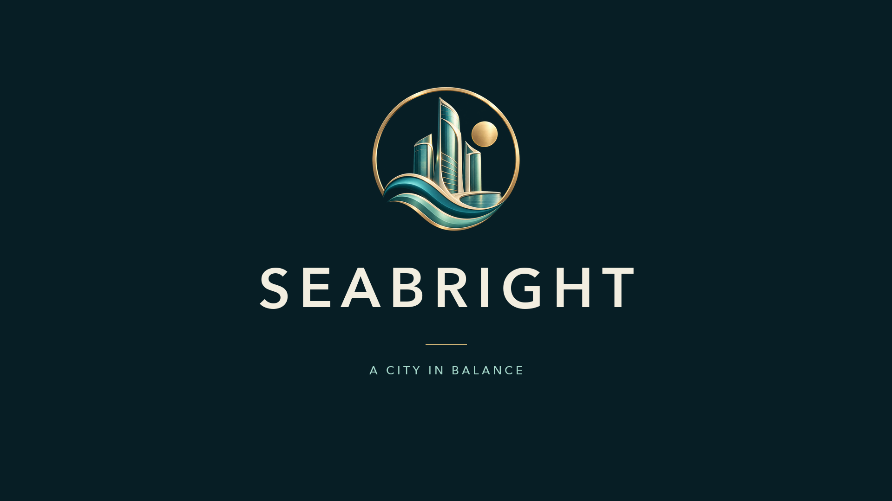

# Seabright

**By [codersusu](https://github.com/codersusu)** · Games · GPT-6 Astra · Codex · Unity · C#

A coastal city builder where a tiny settlement grows into neighborhoods, modern towers and a stadium.

**[Try it live](https://codersusu.github.io/game-city-skylines/)** · [Source](https://github.com/codersusu/game-city-skylines) · [Mac and web downloads](https://github.com/codersusu/game-city-skylines/releases/tag/v0.2.1) · [54-second trailer](../Media/Trailer/Seabright-trailer.mp4)

*Recommended cover image: the earned skyline, captured in Unity with the interface hidden.*

## From one broad brief to a playable city

The owner set the ambition in one broad starting prompt. Codex and Astra chose the architecture, coordinated agents, reused assets, implemented the simulation and tested it. Later feedback asked for stronger art, visible street life, deeper growth, sound and playable distribution.

The cards below turn that work into **short, reusable direction prompts**. They are editorial summaries, not a verbatim sequence of step-by-step instructions from the owner. The images show delivered features. The [original owner prompts](../README.md#key-prompts-from-the-project-owner) remain in the overview.

## Build process

### 1. Start with a playable coastal town

Give the player a small foothold and room to build.

> Build an original coastal city-builder demo in Unity, inspired by Cities: Skylines. Start with a tiny supplied settlement and plenty of empty land. Let me draw roads, zone neighborhoods and manage basic services. Choose a focused scope, handle the design and implementation yourself, and make the first few minutes playable.

### 2. Give every district an identity

Make the city readable from its buildings and streets.

> Make homes, shops and industry look distinct when I place them and after they develop. Give streets visible cars and people, and improve the ground, trees and building materials. Reuse suitable licensed assets first, then create missing details so the whole city shares a consistent coastal style.

### 3. Let the skyline be earned

Turn a small settlement into a connected district with modern towers.

> Make the city grow through real demand, jobs, road access and utilities. Let successful growth unlock offices and residential towers. Keep construction affordable, show why development is stalled, and make the difference between a new settlement and a developed district visible in both the skyline and the economy.

### 4. Give growth a landmark

Make the stadium a destination the player can work toward.

> Add a modern stadium as a later milestone. Give it a recognizable field, seating, roof and entrance. Make it occupy a real site, cost money and need connected services. It should feel like something the city has earned and fit the scale and style of the surrounding neighborhoods.

### 5. Change the mood after dark

Carry the coastal art direction from daylight into night.

> Refine the lighting, water and surface materials so the coast feels cohesive. Add a night view with warm windows, streetlights and a darker waterfront. Keep buildings and roads readable while letting the atmosphere change. Check the result in the actual game camera at both city and street scale.

### 6. Give the city its own sound

Combine a quiet score, environmental layers and useful action feedback.

> Give Seabright original background music, coastal and city ambience, and clear sounds for building, zoning and reaching milestones. Let the soundscape respond to day, night and activity without becoming tiring. Add simple music, ambience, effects and mute controls, and verify that the game actually produces sound.

### 7. Play the growth journey yourself

Verify the experience through a city built under ordinary rules.

> Play from the small starter to a city with occupied towers and a working stadium. Use the real construction controls and ordinary budget. Check visible traffic, building growth, services, saving and loading. Accelerate waiting where useful, fix failures you find, and stop repeating checks once the relevant behavior is verified.

### 8. Make it easy to try and share

Package the playable game and show its journey in a short trailer.

> Ship playable Mac and desktop browser versions with clear launch instructions and persistent saves. Make a short gameplay trailer: a clean title and coastal emblem, construction and growth, skyline and stadium shots, sound, and a closing title. Show real game footage and label accelerated growth so people can understand what they can play.

*Trailer title card; the emblem is original generated branding. The gameplay footage is captured from Unity.*

## Submission assets

**[Download the submission kit](https://github.com/codersusu/game-city-skylines/releases/download/v0.2.1/Seabright-showcase-submission.zip)** — this page, standalone prompts, original-resolution images and a metadata manifest. The game and trailer are linked rather than duplicated in the kit.

Use the skyline as the cover. If only a few gallery images are needed, use **Street life**, **Stadium** and **Night coast**; include **Earned city** when a screenshot of the actual management interface is useful. Keep the title card separate from gameplay screenshots. The images are supplied unchanged, with no generated repainting or upscaling.

| Asset | Original dimensions | Download |
|---|---|---|
| Cover / skyline | 1600 × 1000 | [PNG](https://raw.githubusercontent.com/codersusu/game-city-skylines/4faecc1a658a597d9db247b9f1542c019f828cb6/Documentation/Images/skyline.png) |
| Small beginnings | 1600 × 1000 | [PNG](https://raw.githubusercontent.com/codersusu/game-city-skylines/4faecc1a658a597d9db247b9f1542c019f828cb6/Documentation/Images/starter.png) |
| Street life | 1600 × 1000 | [PNG](https://raw.githubusercontent.com/codersusu/game-city-skylines/4faecc1a658a597d9db247b9f1542c019f828cb6/Artifacts/12-street-life.png) |
| Stadium | 1600 × 1000 | [PNG](https://raw.githubusercontent.com/codersusu/game-city-skylines/4faecc1a658a597d9db247b9f1542c019f828cb6/Documentation/Images/stadium.png) |
| Night coast | 1600 × 1000 | [PNG](https://raw.githubusercontent.com/codersusu/game-city-skylines/4faecc1a658a597d9db247b9f1542c019f828cb6/Documentation/Images/night.png) |
| Sound and music | 1600 × 1000 | [PNG](https://raw.githubusercontent.com/codersusu/game-city-skylines/4faecc1a658a597d9db247b9f1542c019f828cb6/Documentation/Images/sound-settings.png) |
| Earned city / interface | 1920 × 1080 | [PNG](https://raw.githubusercontent.com/codersusu/game-city-skylines/4faecc1a658a597d9db247b9f1542c019f828cb6/Artifacts/13-toolbar-resized.png) |
| Trailer title card | 1920 × 1080 | [PNG](https://raw.githubusercontent.com/codersusu/game-city-skylines/4faecc1a658a597d9db247b9f1542c019f828cb6/Media/Trailer/title-intro.png) |
| Transparent emblem | 1254 × 1254 | [PNG](https://raw.githubusercontent.com/codersusu/game-city-skylines/4faecc1a658a597d9db247b9f1542c019f828cb6/Media/Brand/Seabright-emblem.png) |

The [structured handoff](../Media/Showcase/submission.json) pairs each prompt with its image, alt text, source file, dimensions, provenance and checksum. Its format is local to this project, not a claimed OpenAI submission schema.

## Notes for the showcase editor

- **Scope:** a compact original Unity demo inspired by city-building games. It has a fixed coastal map, aggregate population/economy simulation and starter-to-stadium progression. It does not claim the scale or production quality of Cities: Skylines.
- **Autonomy:** agents performed implementation, art integration and testing. The owner supplied the initial direction and subsequent product feedback. The supplied prompts are condensed editorial guidance, not a claim that every part was separately directed by the owner.
- **Evidence:** the retained autonomous construction journey reached 609 residents without injected resources; the separate trailer capture reached 793. [Review and capture details](REVIEW.md) explain these distinct runs. Still images alone do not demonstrate movement; use the trailer for traffic and growth.
- **Media provenance:** city images are Unity renders or standalone screenshots, captured on 9 September 2026. The interface/street-life shots retain their 0.2.0 origin; the review renders and sound panel are 0.2.1. Rendering algorithms were unchanged by the audio revision. The emblem is original AI-generated art; [its full generation prompt](../Media/Brand/emblem-prompt.txt) is retained.
- **Reused materials:** Kenney and Poly Haven assets retain their CC0 records; the game font retains its SIL Open Font License. Code, original procedural art and synthesized audio are in the project. [Asset provenance and notices](IMPLEMENTATION.md#assets-and-redistribution-records).
- **Availability:** a desktop browser build and Apple Silicon Mac download are public. Browser gameplay was verified on a local server on macOS, and GitHub confirmed the public deployment. Mobile/touch play is outside the verified scope. [Platform validation details](IMPLEMENTATION.md).

Prepared as a submission draft on 15 September 2026. This page has not been submitted to or accepted by OpenAI. Its presentation follows the image-and-direction-prompt approach of [Void Explorer](https://developers.openai.com/showcase/void-explorer); the Seabright text and media are original to this project.
