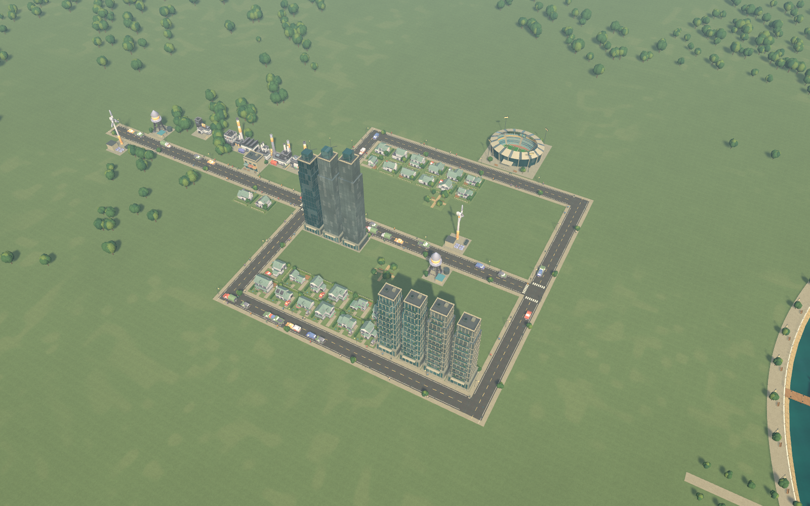

# Seabright — a coastal city builder

**A playable Unity demo built with Codex and GPT-6 Astra.** Start with a tiny settlement, draw streets, grow neighborhoods, balance services and jobs, and unlock a modern skyline and stadium.

**One broad starting prompt; autonomous implementation.** The owner asked for a scoped Cities: Skylines-inspired demo and delegated design, programming, art, testing and agent coordination to Codex. The agents planned and executed the work without a step-by-step implementation recipe. Later messages provided playtest feedback and requested additions such as audio and the trailer; each was carried through by the agents. The trailer itself was also produced from a single creative brief.



[Watch the 54-second gameplay trailer](Media/Trailer/Seabright-trailer.mp4) · [Trailer review](Documentation/REVIEW.md#gameplay-trailer)

**[Play in your browser](https://codersusu.github.io/game-city-skylines/)** · **[Download Mac (Apple Silicon)](https://github.com/codersusu/game-city-skylines/releases/download/v0.2.1/Seabright-macOS-AppleSilicon.zip)** · **[Download WebGL ZIP](https://github.com/codersusu/game-city-skylines/releases/download/v0.2.1/Seabright-WebGL.zip)**

## Purpose and scope

This project tests AI's ability to develop a simulation game end to end: game design, reusable and original art, programming, sound, autonomous playtesting, and revision after human feedback. Cities: Skylines provides the planning reference. Seabright is an original, compact interpretation with its own code, interface, landmarks and music, plus licensed reusable assets.

The delivered **0.2.1** demo has a fixed 48 × 48 coastal map, aggregate population/economy simulation and a complete starter-to-stadium progression. It does not match Cities: Skylines' production quality, scale, traffic simulation or range of services. Its strengths and remaining gaps are shown in the [screenshot review](Documentation/REVIEW.md).

## Documentation

| Document | What it covers |
|---|---|
| **This overview** | Purpose, scope, quick start, development time/cost and the owner's key prompts |
| [Game design](Documentation/GAME_DESIGN.md) | Player experience, rules, progression, economy, services and audiovisual direction |
| [Implementation and status](Documentation/IMPLEMENTATION.md) | Architecture, build/test instructions, verified results, limitations and next steps |
| [Changelog](CHANGELOG.md) | Changes from the first prototype through the current build |
| [Review and screenshots](Documentation/REVIEW.md) | Current game images, feedback outcomes and evidence |

## Key features

- **Build from a small foothold:** 24 residents, $30,000, a gateway street and essential utilities.
- **Develop distinct districts:** homes, shops, industry, residential towers and office zones have different sites and architecture.
- **Manage growth:** demand, jobs, taxes, pollution, land value, power, water, parks and healthcare affect the city.
- **Earn a skyline:** offices unlock at 150 residents, residential towers at 350, and a functioning 3 × 3 stadium at 600.
- **See and hear activity:** road-routed cars, animated walkers, textured surfaces, day/night lighting, music, ambience and interaction sounds.
- **Keep control:** supply overlays, property inspection, budget controls, pause/speed, photo mode, sound settings and versioned saves.

## Play and build

Play the [web version](https://codersusu.github.io/game-city-skylines/) with a desktop keyboard and mouse. Click **Load game**, then **Enter Seabright** to enable sound. Use the in-game **Save** and **Load City** buttons; saves stay in that browser's site storage and survive reloads. Clearing site data removes them. The web build has been checked in Codex's desktop browser on macOS; mobile/touch play is not supported.

The [download release](https://github.com/codersusu/game-city-skylines/releases/tag/v0.2.1) includes an **Apple Silicon Mac app** and a **WebGL ZIP** for self-hosting, plus SHA-256 checksums. The Mac app is ad-hoc signed, not notarized; macOS may require **Open Anyway** in Privacy & Security. To run the extracted web ZIP locally, serve its folder with `python3 -m http.server 8080 --bind 127.0.0.1` and visit `http://127.0.0.1:8080/`.

Open this repository as a project in **Unity 6000.6.0f1**, open `Assets/Scenes/Seabright.unity`, and press **Play**. No API key is needed to run the game. All required art, fonts and audio are in the repository.

On a Mac with Apple Silicon and Unity's macOS build support installed:

```sh
bash Tools/build.sh build
open Builds/Seabright.app
```

The build helper uses Unity Hub's standard editor location; set `UNITY_EDITOR` to override it. Close an editor instance using this project before a CLI build. **Play Seabright.command** launches the local app after it has been built. For WebGL, install Unity's Web Build Support module and run `bash Tools/build.sh web`; output goes to `Builds/WebGL`. Build folders are excluded from the source branch; downloadable binaries live in Releases, and the hosted web files live on `gh-pages`. Intel Mac, Windows, Linux and mobile builds have not been verified.

### Your first neighborhood

1. Press **1**, drag from the end of the existing street, and release to construct a road.
2. Paint homes with **2**, shops with **3**, and industry with **4** beside connected streets. Keep industry away from homes.
3. Let time run at **1× or 3×**. Supplied sites become buildings in roughly 15–25 seconds at 1× when demand is healthy; occupants arrive afterward.
4. Inspect buildings and use the power/water overlays to find gaps. Add jobs, services and parks as the population grows.
5. Keep operating income healthy while working toward the three population milestones.

| Action | Control |
|---|---|
| Move / orbit / zoom | WASD or arrows / Q–E / scroll |
| Tilt and orbit | Middle-button drag |
| Roads / homes / shops / industry / parks | 1 / 2 / 3 / 4 / 5 |
| Other facilities, towers, offices, stadium | Bottom toolbar |
| Inspect / bulldoze | Inspect tool / B |
| Cancel tool / close dialog | Right-click / Escape |
| Pause / run | Space; top bar offers pause, 1× and 3× |
| Day/night / photo mode / home view | N / F / Home |
| Save / load | F5 / F9 |
| Sound mix / mute | SOUND & MUSIC above NEW CITY / M |

The normal Mac save is `~/Library/Application Support/Seabright Studio/Seabright/seabright-city.json`. Older version-1 saves load into the current version-2 format. Tests use an isolated artifact save. **NEW CITY** offers Save & Start, Start Fresh and Cancel.

## How it was built

The primary agent coordinated development and integration, with **11 development subagent roles used across different phases**, covering simulation, art, assets, UI, build investigation, growth and audio verification. That is a cumulative role count, not 11 simultaneous agents. The owner supplied direction, tested ordinary interaction and identified gaps that prompted the growth/art and audio revisions.

Unity's CLI handled compilation and packaging; computer use provided native interaction checks. Compatible Kenney CC0 assets were reused first, then Poly Haven CC0 surface scans and original procedural architecture, geometry and shaders supplied missing detail. The 15 audio clips were synthesized for this project. **No Mesh AI generation or paid asset purchase was recorded.** Third-party licenses and provenance remain with the assets and in the packaged notices.

Verification combined deterministic simulation checks, autonomous construction through the game's real pointer handler, actual rendered-pixel/movement checks, source-image review and listener PCM measurements. The growth run reached **609 residents and a working stadium without injected funds or population**. Later waiting was accelerated through the same simulation; the first construction was observed at normal speed. The [implementation document](Documentation/IMPLEMENTATION.md) explains exactly which claims were tested on each version.

## Development time and cost

These figures cover development **through the completed 0.2.1 audio delivery on 9 September 2026**, before documentation, GitHub publication, trailer production and the web port/release. They are reconstructed from retained local session records, not estimates based on code size.

| Measure | Recorded result |
|---|---:|
| Primary-agent task duration | **2 h 32 m 43 s** |
| First request to completed audio delivery, wall clock | **11 h 15 m 15 s** |
| UTC interval | 8 Sep 22:34:56 → 9 Sep 09:50:11 |
| Distinct model responses, primary plus development agents | **526** |
| Input tokens, including cached input | **45,001,539** |
| Cached input tokens, included above | **43,595,392** |
| Uncached input tokens | **1,406,147** |
| Recorded cache-write input tokens | **0** |
| Output tokens, including reasoning | **285,783** |
| Reasoning output tokens, included above | **80,824** |
| Input + output total | **45,287,322** |

The shorter duration is the sum of Codex's recorded task durations for the primary agent, including interrupted turns. The wall-clock interval also includes overnight idle time and gaps between requests. Parallel agent durations must not be added to wall time. Neither figure is a human labor timesheet. Cached tokens largely represent previously processed context reused across requests; they are not 43 million newly written words.

At the published **standard GPT-6 Astra API rates** checked on 9 September 2026, the retained usage has an **API-price equivalent of $71.95**: $14.06 uncached input + $43.60 cached input + $14.29 output. The rates are $10, $1 and $50 per million respectively; recorded cache writes were zero. No counted request exceeded the 272,000-input-token long-context threshold. [Official model pricing](https://developers.openai.com/api/docs/models/gpt-6-astra).

**This is not the actual amount charged.** It applies standard API prices to observed tokens, without speed-tier multipliers, tool charges, taxes, hardware, electricity or a subscription allocation. Codex plan allowances and credits have their own charging rules. The actual billed project cost was not available from the local records. [Codex pricing and usage](https://learn.chatgpt.com/docs/pricing).

[The sanitized metrics record](Artifacts/development-metrics.json) includes the breakdown by development role and the calculation method. Each response is counted once using its usage record; cumulative totals and duplicated history are not summed. Automatic approval-review sessions and unrelated tasks are excluded. Raw conversation logs, credentials and personal save backups are not published.

## Key prompts from the project owner

The first prompt below launched autonomous development. The subsequent prompts record product feedback, environment preferences and additional deliverables, rather than step-by-step implementation instructions. They preserve the owner's original wording; the quoted initial brief and publication request are excerpts. Automatic continuation instructions and assistant-generated agent assignments are excluded.

<details>
<summary>1. Initial brief — test autonomous simulation-game development</summary>

> Can you mimic the famous game City Skyline? I want to test the ability of Codex and Astra in making simulation games. You can use the Unity game engine. Try to build the art design, the visual effect, the game mechanism, and everything else as similar as City Skyline. Keep the same high quality. Although this is just a demo, so you can limit the scope.

> But I want to really demonstrate the AI capability not only in making a game work, but also in high quality of art and design, and software programming, and also understanding the game mechanism, and also test and play by itself to achieve autonomous development. You may also ramp up sub-agents.

> But avoid overcautious and repetitive testing on the same content.

> So try to reuse material as much as possible.

The rest of the brief offered up to five subagents plus a lead developer, confirmed Unity was installed, and established the asset order: reuse suitable material, author missing models, then use Mesh AI only if needed. The final delivery is a scoped original demo; commercial-game parity was not achieved.

</details>

<details>
<summary>2. Prefer the Unity CLI, with computer use as backup</summary>

> you should be able to open unity via computer use, but via CLI is faster, use computer use as backup

</details>

<details>
<summary>3. Explain and demonstrate play</summary>

> how to play this game?

> can you play the game to show me how to play it? you may use computer use or any other method

</details>

<details>
<summary>4. Revise art, visible life, icons and growth</summary>

> some feedbacks:
> 1. the homes, shops, industry all look the same when I place them on the map.
> 2. street has nothing to moving, no cars, no people, etc.
> 3. the steets, building, trees and ground and seas looks so simple  -- in general, everything is too low poly or missing proper textual
> 4. the icon of items on bottom menu are also black / blank.
> 5. I want to build the city from almost scatch and be able to expand and grow with fancy, modern facilities like sky scrapers anad stadiums, etc.
> playtest yourself to ensure the growth exeprience of city

</details>

<details>
<summary>5. Add sound effects and background audio</summary>

> can you add sounds effect and background souds is not exit yet?

</details>

<details>
<summary>6. Publish the code, evidence and development story</summary>

> okay great. please submit code to this repo: https://github.com/codersusu/game-city-skylines

> Also, the how much time it takes to build this and the cost it takes. If you can find the token cost, like input-output, catch token, this kind of thing.

> Oh no, put the prompts in the overview doc.

The complete request also asked for a game design doc, implementation/status/next steps, changelog, overview, and screenshots on a review page. This documentation structure follows that request.

</details>

<details>
<summary>7. Create a gameplay trailer and original emblem</summary>

> Can you make a Steam-style trailer for this game? So you have, like, three seconds, like, enlarged title of the game with icons, and make it kind of, like, no background, so focusing on the titles. And then you show the gameplay with audio, show different features of the game, and also show a city, like, grown from scratch to a metro city, and then finish with another, like, enlarged, like, title icon page. Around one minute in total, like half a minute to one minute. I think if you don't have, you should also create a beautiful icon, which fits to the background of this game. Yeah.

The resulting 54-second trailer shows the actual demo's small-settlement-to-tower progression, with accelerated growth identified on screen. It uses a new original sea-and-skyline emblem and the game's own music, ambience and effects.

</details>
